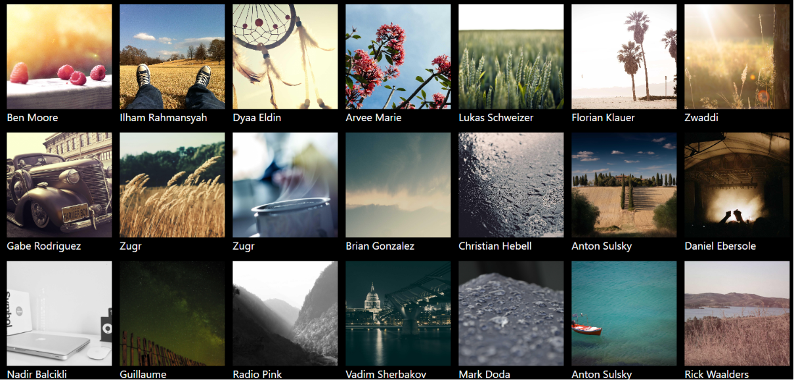

# 📸 Photo Browser

A modern React application that fetches and displays stunning images from the Picsum API. Users can browse a collection of high-quality photos, view photographer details, and open original images in a new tab.


---

## ✨ Features

* 📷 Fetches images dynamically from the Picsum API
* 🎨 Responsive image gallery layout
* 👤 Displays photographer/author information
* 🔗 Open original image source in a new tab
* ⚡ Fast and lightweight React application
* 📱 Responsive design for desktop and mobile devices

---

## 🛠️ Tech Stack

### Frontend

* React.js
* JavaScript (ES6+)
* Tailwind CSS

### API

* Axios
* Picsum Photos API

---

## 📂 Project Structure

```bash
photo-browser/
│
├── src/
│   ├── App.jsx
│   ├── main.jsx
│   └── index.css
│
├── public/
├── package.json
└── README.md
```

---

## 📸 Screenshots





---

## ⚙️ Installation

Clone the repository:

```bash
git clone https://github.com/adarshrajshah04/photo-browser.git
```

Navigate to the project folder:

```bash
cd photo-browser
```

Install dependencies:

```bash
npm install
```

Start the development server:

```bash
npm run dev
```

---

## 🔗 API Used

Picsum Photos API

```bash
https://picsum.photos/v2/list?page=2&limit=200
```

---

## 🎯 Learning Outcomes

This project helped in understanding:

* React Hooks (`useState`, `useEffect`)
* API Integration using Axios
* State Management
* Dynamic Rendering with `.map()`
* Responsive UI Development
* Handling Asynchronous Data

---

## 🤝 Contributing

Contributions, issues, and feature requests are welcome.

Feel free to fork the project and submit a pull request.

---

## 👨‍💻 Author

**Adarshraj Shah**

* GitHub: https://github.com/adarshrajshah04


---

## ⭐ Support

If you found this project helpful, please consider giving it a star on GitHub.

⭐ Star this repository to support future development.
